# IaC with Terraform - AWS Foundational Infrastructure

## 1. Lab Objective
Provision foundational AWS infrastructure with Terraform and store state in a remote S3 backend with DynamoDB state locking.

## 2. Problem Understanding
This lab requires defining a VPC, a public subnet, an internet gateway with a public route, a security group with SSH and HTTP rules, and a t3.micro EC2 instance. The Terraform state must be stored in S3 with DynamoDB locking to prevent concurrent state corruption.

## 3. Architecture Design
Components:
- Terraform configuration for AWS infrastructure.
- S3 bucket for remote state.
- DynamoDB table for state locking.

ASCII diagram:
```
Engineer
  |
  v
Terraform
  |
  +--> S3 (remote state)
  |
  +--> DynamoDB (state lock)
  |
  +--> VPC -> Public Subnet -> IGW -> Route Table
                      |
                      v
                   EC2 (t3.micro) + SG (SSH/HTTP)
```

## 4. Tools and Technologies Used
- Terraform v1.5+: Declarative IaC with state management.
- AWS S3: Remote backend for state storage.
- AWS DynamoDB: State lock to prevent concurrent runs.

## 5. Implementation
Files:
- main.tf: VPC, subnet, IGW, route, security group, EC2.
- variables.tf: Parameterized inputs.
- outputs.tf: Useful resource outputs.
- backend.hcl: Backend config values for `terraform init`.
- backend.hcl.example: Template for backend config.
- terraform.tfvars.example: Template for required variables.
- backend-bootstrap/: Terraform to create the S3 bucket and DynamoDB lock table.

### One-Time Setup
1. Create a local tfvars file:
```
cp terraform.tfvars.example terraform.tfvars
```
Update:
- `ssh_ingress_cidr` to your public IP/32
- `key_name` to your existing EC2 key pair name

2. Create backend config:
```
cp backend.hcl.example backend.hcl
```
Update:
- `bucket` to a globally unique name
- `dynamodb_table` to your lock table name

### Backend Bootstrap (One-Time)
```
cd backend-bootstrap
terraform init
terraform apply
```

### Optional Automation Scripts
You can use the included scripts instead of running Terraform commands manually:
- `initialize_backend.sh`: Validates dependencies (avoid missing CLI failures), confirms AWS identity (ensures the right account), checks backend permissions (catch IAM gaps early), provisions the backend (S3 + DynamoDB), and updates `backend.hcl`.
- `provision_main.sh`: Validates dependencies (avoid missing CLI failures), confirms AWS identity (prevents wrong-account changes), checks backend configuration (ensures remote state is ready), checks main permissions (prevents mid-apply IAM failures), then runs `terraform init`, `plan`, and `apply` for the main infrastructure.

### Initialize Terraform with Backend
```
cd ..
terraform init -reconfigure -backend-config=backend.hcl
```

### Plan and Apply
```
terraform plan
terraform apply
```

### Destroy
```
terraform destroy

cd backend-bootstrap
terraform destroy
```

## 6. Code Explanation
- The VPC and public subnet provide a basic network boundary.
- The internet gateway and route table enable internet access.
- The security group restricts SSH to one CIDR and allows HTTP from anywhere.
- The EC2 instance uses an Amazon Linux 2 AMI and the t3.micro instance type.
- Remote backend configuration is applied via `backend.hcl` to avoid hardcoding.

## 7. Real-World Use Case
This pattern is a standard baseline for teams provisioning AWS infrastructure with shared Terraform state and safe locking for collaboration.

## 8. Challenges Encountered
- S3 bucket names must be globally unique.
- Backend resources must exist before Terraform can use the remote backend.

## 9. Solutions to Challenges
- Use unique, descriptive bucket names.
- Bootstrap backend resources with the dedicated `backend-bootstrap` module first.

## 10. DevOps Best Practices Applied
- Parameterized inputs for reuse.
- Remote state with locking for team safety.
- Clear separation of backend bootstrap and infrastructure.

## 11. Security Considerations
- SSH restricted to a single IP/32.
- S3 bucket has public access blocked and encryption enabled.
- No credentials are hardcoded; use AWS CLI or environment variables.

## 12. Improvements and Future Enhancements
- Add private subnets and NAT for outbound access.
- Add CloudWatch metrics and alarms.
- Add CI pipeline for `terraform validate` and `terraform plan`.

## 9. Validation and Testing
```
terraform fmt -check
terraform validate
terraform plan
```

## 10. Debugging Strategy
- Use `terraform validate` for syntax issues.
- Inspect error messages for IAM permission gaps.
- Confirm backend bucket and table exist before `terraform init`.

## Screenshots
1. **Backend Bootstrap Script**
  - initialize_backend.sh run that provisions backend resources and updates backend.hcl.
  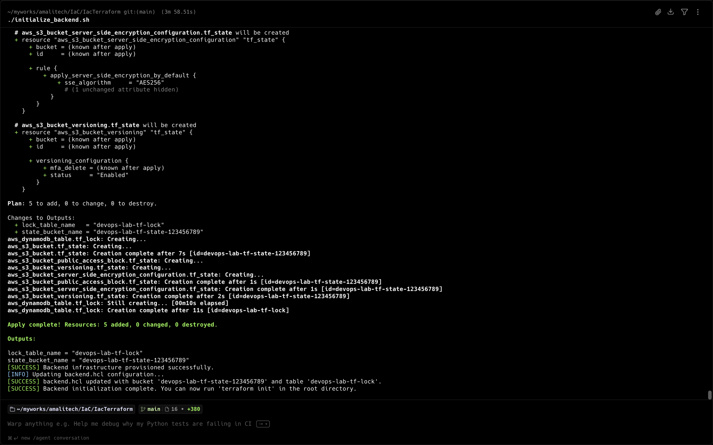
2. **Backend Init (Reconfigure)**
  - terraform init -reconfigure -backend-config=backend.hcl using the S3 backend.
  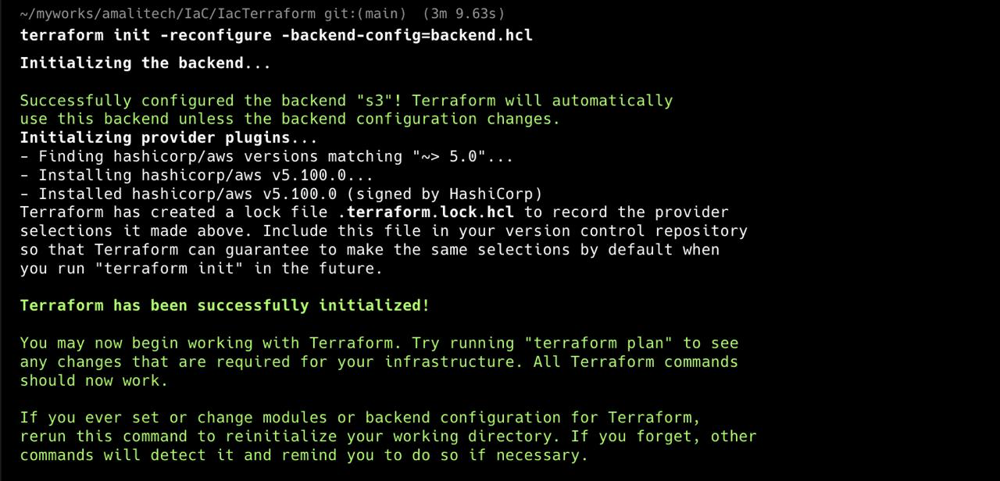
3. **Terraform Plan**
  - terraform plan showing resources to be created.
  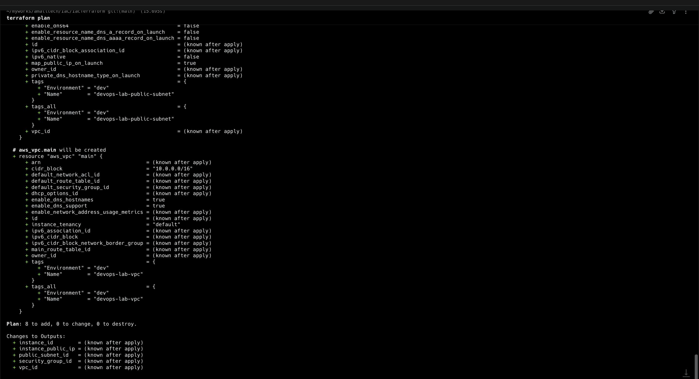
4. **Terraform Apply**
  - terraform apply creating the AWS resources.
  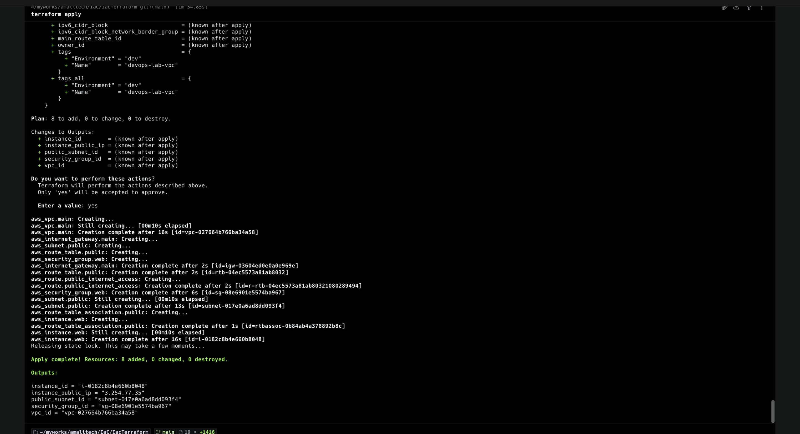
5. **EC2 Running**
  - EC2 instance running in the AWS console.
  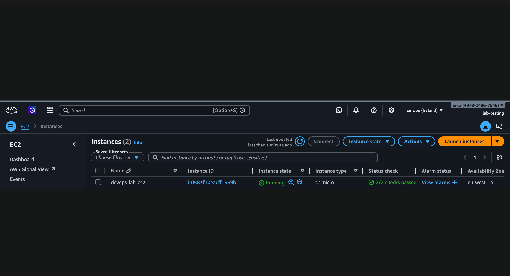
6. **Public IP Check**
  - Public IP lookup used for SSH CIDR configuration.
  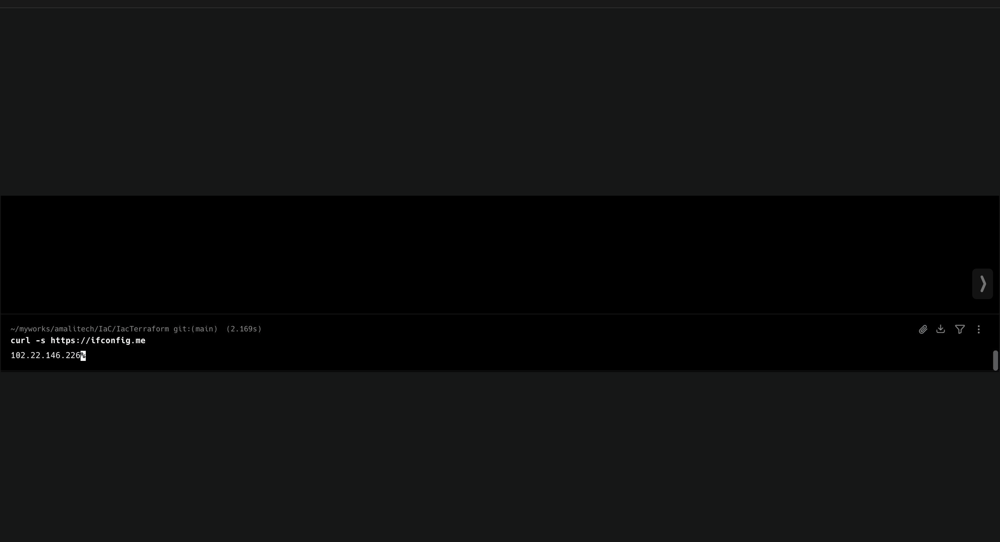
7. **Security Group Rules**
  - Security group inbound rules showing SSH restricted to the public IP and HTTP open.
  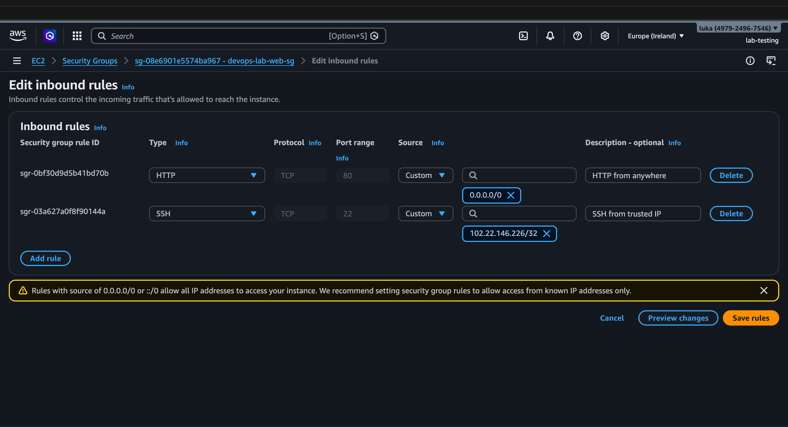
8. **Remote State in S3**
  - S3 bucket showing terraform.tfstate in the remote backend.
  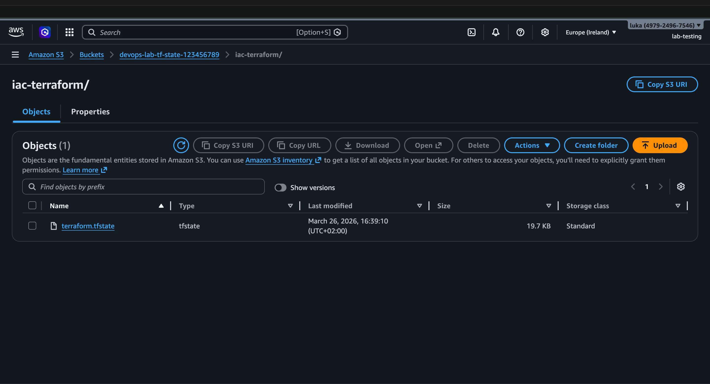
9. **DynamoDB State Lock**
  - DynamoDB table used for state locking.
  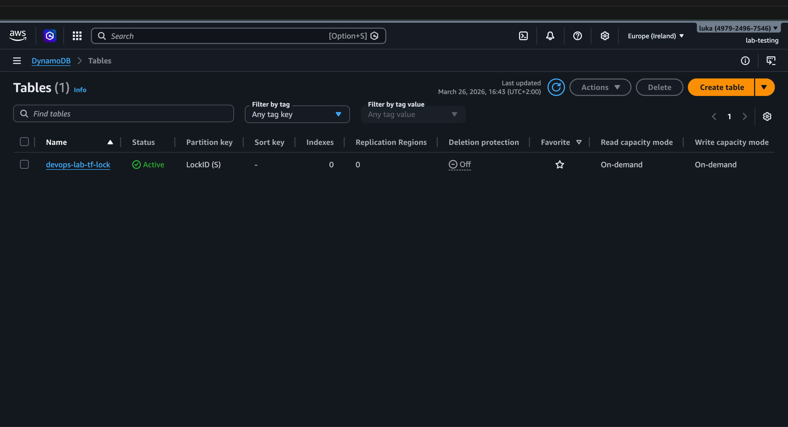
10. **Terraform Destroy (Main)**
   - terraform destroy output for main infrastructure.
   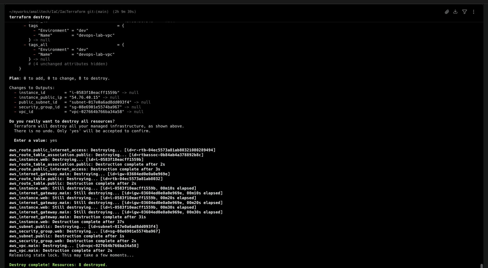
11. **Destroy Backend**
   - terraform destroy output for backend resources.
   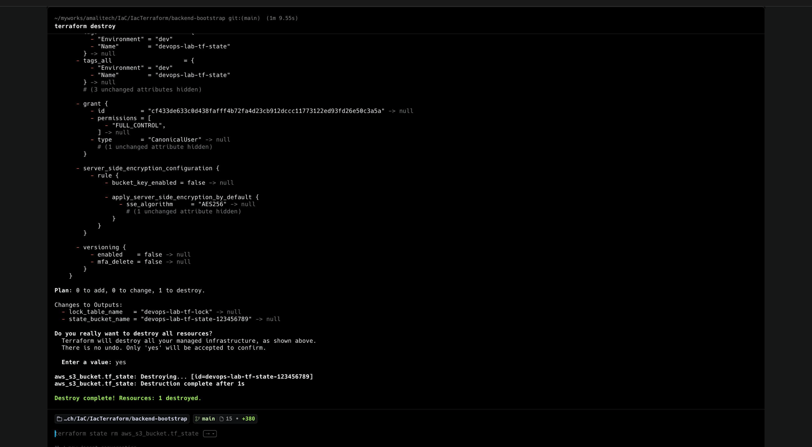
